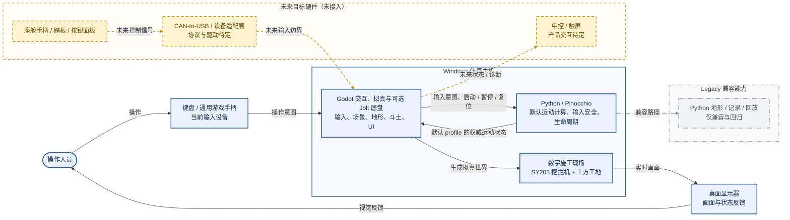

# ExcavatorSim 概念架构

> 面向项目负责人、产品、现场与非技术协作者。事实截止：**2026-08-17**。
>
> 一句话理解：**人给出操作意图；默认由 Python 计算运动，或显式选择 Jolt 计算底盘/履带；Godot 负责本地世界与拟真画面，Python 始终保留输入安全和生命周期边界。**

## 图例

| 样式 | 状态 | 本项目中的含义 |
|---|---|---|
| 蓝色实线、实底 | 当前已实现 | 当前 Godot-first 产品主路径，仓库中已有运行与测试证据 |
| 灰色点划线、浅灰底 | Legacy 兼容 | 仍保留用于兼容与回归，但不是当前产品主路径 |
| 黄色虚线、浅黄底 | 未来规划 / 未接入 | 目标方向；当前尚无硬件驱动、CAN 协议或产品接入实现 |

## 版本 A：Mermaid

## 版本 B：HTML

<svg xmlns="http://www.w3.org/2000/svg" viewBox="0 0 1420 760" role="img" aria-label="ExcavatorSim 概念架构 HTML 图" style="width:100%; max-width:1420px; height:auto;">
  <defs>
    <marker id="arrow-current" markerWidth="10" markerHeight="10" refX="9" refY="3" orient="auto" markerUnits="strokeWidth"><path d="M0,0 L0,6 L9,3 z" fill="#315b8a"/></marker>
    <marker id="arrow-legacy" markerWidth="10" markerHeight="10" refX="9" refY="3" orient="auto" markerUnits="strokeWidth"><path d="M0,0 L0,6 L9,3 z" fill="#7a818a"/></marker>
    <marker id="arrow-planned" markerWidth="10" markerHeight="10" refX="9" refY="3" orient="auto" markerUnits="strokeWidth"><path d="M0,0 L0,6 L9,3 z" fill="#b98900"/></marker>
  </defs>

  <rect x="410" y="35" width="650" height="385" rx="18" fill="#f7faff" stroke="#315b8a" stroke-width="3"/>
  <text x="735" y="68" text-anchor="middle" font-size="22" font-weight="700" fill="#172b4d">Windows 仿真主机</text>

  <rect x="25" y="120" width="145" height="82" rx="14" fill="#eaf2ff" stroke="#315b8a" stroke-width="3"/>
  <text x="97" y="169" text-anchor="middle" font-size="21" font-weight="700" fill="#172b4d">操作人员</text>

  <rect x="215" y="110" width="170" height="102" rx="12" fill="#eaf2ff" stroke="#315b8a" stroke-width="3"/>
  <text x="300" y="150" text-anchor="middle" font-size="18" font-weight="700" fill="#172b4d">键盘 / 通用手柄</text>
  <text x="300" y="180" text-anchor="middle" font-size="15" fill="#315b8a">当前输入设备</text>

  <rect x="445" y="100" width="250" height="120" rx="12" fill="#eaf2ff" stroke="#315b8a" stroke-width="3"/>
  <text x="570" y="140" text-anchor="middle" font-size="21" font-weight="700" fill="#172b4d">Godot</text>
  <text x="570" y="170" text-anchor="middle" font-size="15" fill="#315b8a">输入、场景、地形、斗土、UI</text>
  <text x="570" y="195" text-anchor="middle" font-size="15" fill="#315b8a">交互、拟真与可选 Jolt 底盘</text>

  <rect x="775" y="100" width="250" height="120" rx="12" fill="#eaf2ff" stroke="#315b8a" stroke-width="3"/>
  <text x="900" y="140" text-anchor="middle" font-size="21" font-weight="700" fill="#172b4d">Python / Pinocchio</text>
  <text x="900" y="170" text-anchor="middle" font-size="15" fill="#315b8a">默认运动计算、输入安全</text>
  <text x="900" y="195" text-anchor="middle" font-size="15" fill="#315b8a">生命周期</text>

  <rect x="550" y="290" width="370" height="95" rx="12" fill="#eaf2ff" stroke="#315b8a" stroke-width="3"/>
  <text x="735" y="330" text-anchor="middle" font-size="21" font-weight="700" fill="#172b4d">数字施工现场</text>
  <text x="735" y="360" text-anchor="middle" font-size="16" fill="#315b8a">SY205 挖掘机 + 土方工地</text>

  <rect x="1110" y="125" width="260" height="100" rx="12" fill="#eaf2ff" stroke="#315b8a" stroke-width="3"/>
  <text x="1240" y="165" text-anchor="middle" font-size="21" font-weight="700" fill="#172b4d">桌面显示器</text>
  <text x="1240" y="195" text-anchor="middle" font-size="15" fill="#315b8a">画面与状态反馈</text>

  <line x1="170" y1="161" x2="215" y2="161" stroke="#315b8a" stroke-width="3" marker-end="url(#arrow-current)"/>
  <text x="192" y="148" text-anchor="middle" font-size="13" fill="#315b8a">操作</text>
  <line x1="385" y1="161" x2="445" y2="161" stroke="#315b8a" stroke-width="3" marker-end="url(#arrow-current)"/>
  <text x="415" y="148" text-anchor="middle" font-size="13" fill="#315b8a">意图</text>
  <line x1="695" y1="135" x2="775" y2="135" stroke="#315b8a" stroke-width="3" marker-end="url(#arrow-current)"/>
  <text x="735" y="120" text-anchor="middle" font-size="12" fill="#315b8a">输入 / 命令</text>
  <line x1="775" y1="190" x2="695" y2="190" stroke="#315b8a" stroke-width="3" marker-end="url(#arrow-current)"/>
  <text x="735" y="210" text-anchor="middle" font-size="12" fill="#315b8a">默认权威运动状态</text>
  <line x1="570" y1="220" x2="650" y2="290" stroke="#315b8a" stroke-width="3" marker-end="url(#arrow-current)"/>
  <text x="585" y="260" font-size="13" fill="#315b8a">生成世界</text>
  <line x1="920" y1="338" x2="1110" y2="190" stroke="#315b8a" stroke-width="3" marker-end="url(#arrow-current)"/>
  <text x="1028" y="280" font-size="13" fill="#315b8a">实时画面</text>
  <path d="M1240 225 C1240 445, 97 445, 97 202" fill="none" stroke="#315b8a" stroke-width="3" marker-end="url(#arrow-current)"/>
  <text x="670" y="448" text-anchor="middle" font-size="14" fill="#315b8a">视觉反馈返回操作人员</text>

  <rect x="760" y="485" width="610" height="215" rx="16" fill="#fafafa" stroke="#7a818a" stroke-width="2" stroke-dasharray="12 5 2 5"/>
  <text x="1065" y="520" text-anchor="middle" font-size="19" font-weight="700" fill="#4b5158">Legacy 兼容能力</text>
  <rect x="900" y="555" width="330" height="95" rx="12" fill="#f2f3f5" stroke="#7a818a" stroke-width="2" stroke-dasharray="12 5 2 5"/>
  <text x="1065" y="595" text-anchor="middle" font-size="18" font-weight="700" fill="#4b5158">Python 地形 / 记录 / 回放</text>
  <text x="1065" y="625" text-anchor="middle" font-size="14" fill="#626970">仅兼容与回归</text>
  <path d="M900 220 C980 330, 1065 430, 1065 555" fill="none" stroke="#7a818a" stroke-width="2" stroke-dasharray="12 5 2 5" marker-end="url(#arrow-legacy)"/>
  <text x="1012" y="405" font-size="13" fill="#626970">兼容路径</text>

  <rect x="25" y="485" width="690" height="215" rx="16" fill="#fffdf5" stroke="#b98900" stroke-width="2" stroke-dasharray="10 7"/>
  <text x="370" y="520" text-anchor="middle" font-size="19" font-weight="700" fill="#5f4600">未来目标硬件（未接入）</text>
  <rect x="50" y="555" width="210" height="95" rx="12" fill="#fff4cf" stroke="#b98900" stroke-width="2" stroke-dasharray="10 7"/>
  <text x="155" y="590" text-anchor="middle" font-size="17" font-weight="700" fill="#5f4600">座舱手柄 / 踏板</text>
  <text x="155" y="620" text-anchor="middle" font-size="14" fill="#7a5a00">按钮面板</text>
  <rect x="315" y="555" width="220" height="95" rx="12" fill="#fff4cf" stroke="#b98900" stroke-width="2" stroke-dasharray="10 7"/>
  <text x="425" y="590" text-anchor="middle" font-size="17" font-weight="700" fill="#5f4600">CAN-to-USB</text>
  <text x="425" y="620" text-anchor="middle" font-size="14" fill="#7a5a00">设备适配层 · 协议待定</text>
  <rect x="580" y="555" width="110" height="95" rx="12" fill="#fff4cf" stroke="#b98900" stroke-width="2" stroke-dasharray="10 7"/>
  <text x="635" y="590" text-anchor="middle" font-size="17" font-weight="700" fill="#5f4600">中控</text>
  <text x="635" y="620" text-anchor="middle" font-size="14" fill="#7a5a00">触屏</text>
  <line x1="260" y1="602" x2="315" y2="602" stroke="#b98900" stroke-width="2" stroke-dasharray="10 7" marker-end="url(#arrow-planned)"/>
  <path d="M425 555 C425 455, 500 390, 540 220" fill="none" stroke="#b98900" stroke-width="2" stroke-dasharray="10 7" marker-end="url(#arrow-planned)"/>
  <path d="M600 220 C650 360, 650 455, 635 555" fill="none" stroke="#b98900" stroke-width="2" stroke-dasharray="10 7" marker-end="url(#arrow-planned)"/>
  <text x="445" y="465" font-size="13" fill="#7a5a00">未来输入边界</text>
  <text x="655" y="465" font-size="13" fill="#7a5a00">未来状态 / 诊断</text>
</svg>

HTML/SVG 版中的两条 Godot/Python 箭头是默认 profile 的两个方向：Godot
发送操作意图和生命周期命令，Python 返回权威运动状态。显式
`jolt_authoritative` 时，Godot/Jolt 在同一进程内独占底盘/履带姿态，工作装置
冻结；Python 不再把 pose 写入画面。

## 不依赖图片也能读懂

| 问题 | 当前答案 |
|---|---|
| 谁操作？ | 操作人员通过键盘或通用游戏手柄输入；未来才考虑真实座舱手柄、踏板和按钮面板。 |
| 谁计算？ | 默认由 Python/Pinocchio 计算运动；显式 Jolt profile 由 Godot 计算底盘/履带，工作装置暂时冻结。Python 始终执行输入安全与启动、暂停、复位控制。 |
| 谁生成画面？ | Godot 按当前 profile 应用唯一权威姿态，同时维护本地施工地形、斗土表现、天空、相机和 UI。 |
| 在哪里看到结果？ | 当前输出到 Windows 桌面显示器；未来中控/触屏仍处于未接入状态。 |

## 必须知道的边界

- **Python → Godot：**默认/Shadow profile 发送权威关节和机身状态；Jolt
  authoritative profile 拒绝这条 pose 写入。
- **Godot → Python：**发送输入意图以及启动、暂停、复位命令；Shadow profile
  可另发隔离诊断。Jolt authoritative truth 保留在本地，不伪装成 Python shadow 权威。
- **Godot 本地世界：**施工地形、斗土体积和粒子效果服务于交互与拟真呈现，不改变 Python 的运动计算。
- **Legacy：**Python 中保留的地形、记录和回放能力用于兼容与回归；回放不属于当前产品需求。
- **未来硬件：**CAN、中控、触屏和真实座舱设备只是目标拓扑，目前没有驱动、协议或产品接入实现。

## 下一步阅读

- [工程详细架构](./engineering.md)——面向开发人员的组件、接口、信号、时序和维护地图。
- [项目总览](../../README.md)——当前状态、目录与验证入口。
- [Godot 集成边界](../godot-integration.md)——Python/Godot 权威划分及地形、视觉实现约束。
