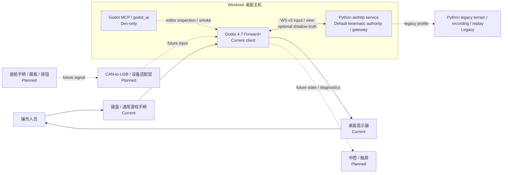
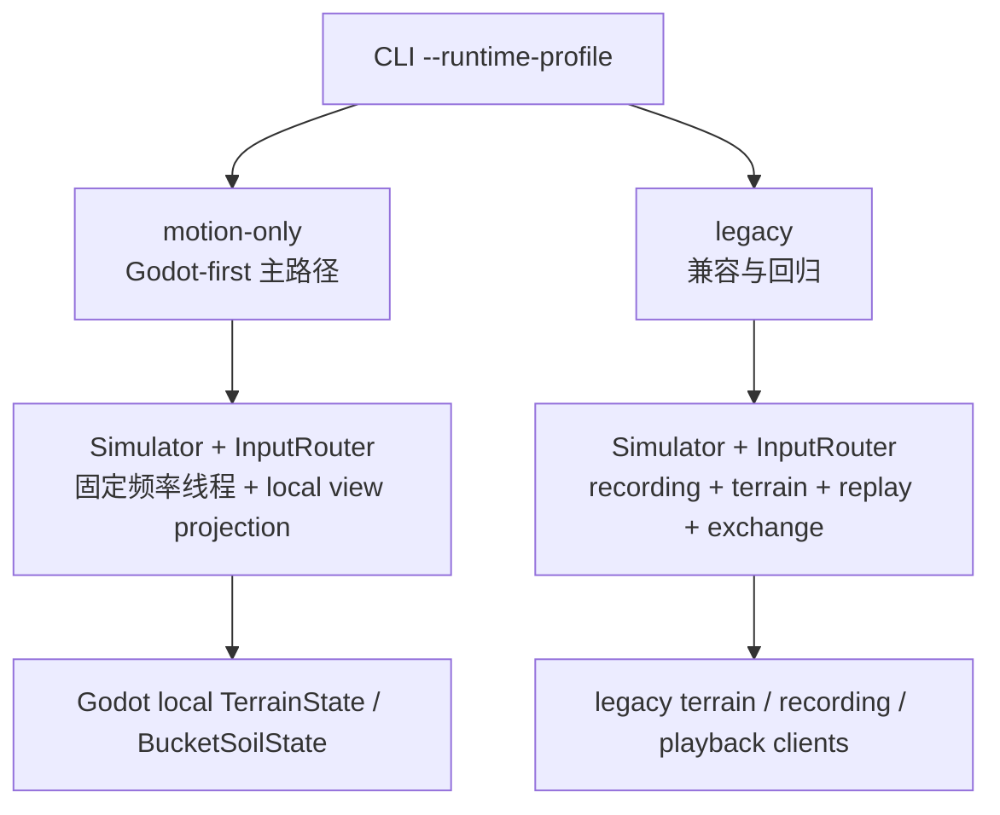
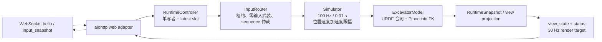
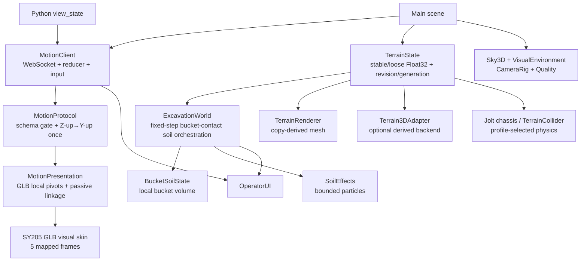
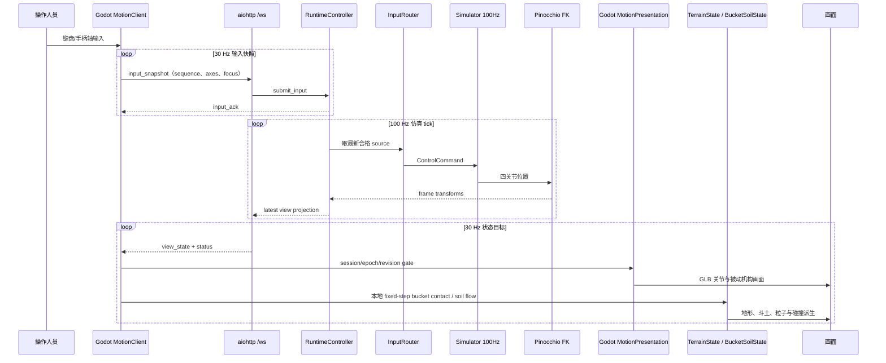
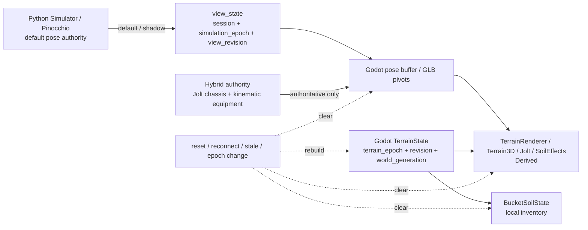
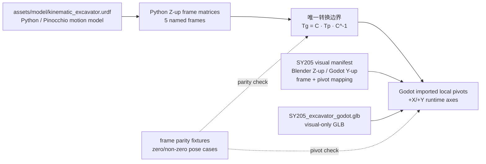
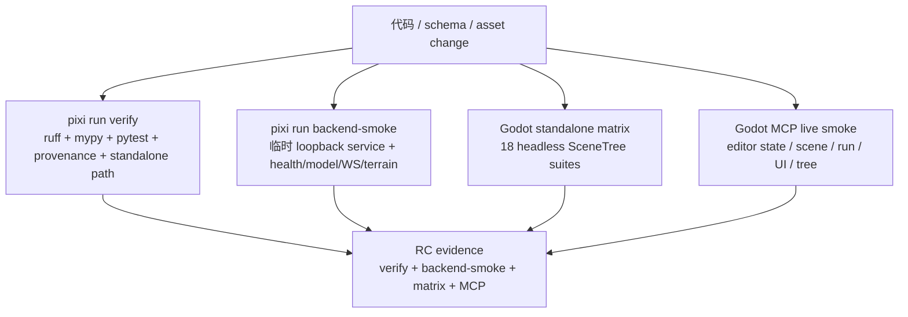

# ExcavatorSim 工程详细架构

> 面向工程、开发、测试与长期维护。事实截止：**2026-08-17**。
>
> 本文是架构导航层，不替代协议 schema、算法说明或测试契约。若图表与专项契约不一致，以代码、schema 和下方 source-of-truth 索引为准。

## 0. 先读结论

当前产品主路径是：

```text
输入设备 → Godot MotionClient → WebSocket v3 → Python InputRouter
→ 100 Hz Simulator → Pinocchio FK → view_state
→ Godot MotionPresentation / Terrain / UI → Windows 桌面画面
```

Jolt 权威迁移仍默认关闭：`jolt_shadow` 可在同一连接上发布 Godot fixed-tick
truth 快照到 Python 的隔离 latest-value 诊断槽；它不改变上述产品姿态链。
项目默认仍是 `python_kinematic`。显式选择 `jolt_authoritative` 时，Phase 2 已由
Godot hybrid runtime 取代：Jolt 独占一个动态底盘刚体和履带力，受限运动学状态
独占回转、动臂、斗杆、铲斗姿态，query-only 铲斗代理提供地形接触证据。该模式
生成本地 authoritative truth，但不会把它作为 shadow 发回 Python。

当前权威边界按 profile 切换：

1. `python_kinematic` / `jolt_shadow`：Python/Pinocchio 权威维护四关节与底盘
   frame transforms、输入安全和生命周期；Jolt 仅派生/观察。
2. `jolt_authoritative` Phase 3：Jolt 权威维护单底盘/履带动力学；运动学状态维护
   四关节与 FK，斗内载荷只产生有界速度降级；Python pose 写入被拒绝，视觉、
   query、soil batch 与 truth 消费同一 post-step identity。
3. 所有 Godot-first profile 中，Godot `TerrainState`/`BucketSoilState` 权威维护
   本地地形与斗土状态；Terrain3D、渲染网格、粒子和视觉 GLB 都是派生消费者。

`SimulationTruthPublisher` 是观察者而非第三条写权威；Python 接收的 shadow
数据不得进入 `Simulator`、`view_state`、地形或斗土状态。

Legacy Python terrain/recording/replay 继续存在，但只用于兼容和回归；它不是当前 Godot-first 产品目标，回放也不是当前产品需求。

## 1. 统一状态图例

| 状态 | 图形约定 | 解释 |
|---|---|---|
| Current | 蓝色实线、浅蓝底 | 当前 Godot-first 路径，有代码和测试证据 |
| Legacy | 灰色点划线、浅灰底 | 仍可运行或回归，但只承担兼容职责 |
| Planned | 黄色虚线、浅黄底 | 用户确认的目标方向，当前未接入或协议/驱动未定 |
| Derived | 绿色细线 | 从权威快照派生的渲染、碰撞、粒子或缓存状态 |
| Dev-only | 紫色虚线 | 编辑器开发辅助，不进入导出产品 |
| Deferred | 灰色文字 | 有意延后，不能当作当前验收能力 |

所有视图都使用上述语义。目标座舱手柄、踏板、按钮面板、中控、触屏、CAN-to-USB 只能使用 Planned；仓库没有 `pyserial`、`python-can`、USB/HID、ROS client 或现场总线实现证据。

## 2. 系统上下文与进程边界



### 2.1 进程与启动

| 边界 | 当前事实 | 入口/来源 |
|---|---|---|
| Godot 客户端 | Windows desktop、Godot 4.7、Forward+、1920×1080 stretch；主场景 `res://scenes/main.tscn` | [`godot/client/project.godot`](../../godot/client/project.godot#L11-L48)、[`README.md`](../../README.md#L3-L4) |
| Python 服务 | `pixi run start` 启动 `python -m babylon_sim.cli --frontend-dir godot/dist`；`start-motion-only` 显式选择 motion-only | [`pixi.toml`](../../pixi.toml#L26-L36)、[`backend/src/babylon_sim/cli.py`](../../backend/src/babylon_sim/cli.py#L69-L89) |
| 默认网络 | loopback `127.0.0.1:8765`；Godot 默认 `ws://127.0.0.1:8765/ws` | [`backend/src/babylon_sim/cli.py`](../../backend/src/babylon_sim/cli.py#L23-L47)、[`godot/client/scripts/motion_client.gd`](../../godot/client/scripts/motion_client.gd#L19-L23) |
| MCP | EditorPlugin，默认开发端口 HTTP 8000 / WS 9500；导出时 helper 被剥离 | [`godot/client/addons/godot_ai/plugin.gd`](../../godot/client/addons/godot_ai/plugin.gd#L1-L4)、[`mcp_export_plugin.gd`](../../godot/client/addons/godot_ai/export/mcp_export_plugin.gd#L1-L69) |
| 未来硬件 | 仅目标拓扑；当前没有驱动、总线或中控产品实现 | 代码/依赖检索无 `pyserial`、`python-can`、USB/HID、ROS client 证据 |

MCP 是开发工具，不是 Python 运动服务的替代品，也不是导出包的运行时依赖。

## 3. Runtime profile：当前主路径与兼容分支



| 能力/组件 | `motion-only`（Current 主路径） | `legacy`（Legacy 兼容） |
|---|---|---|
| 运动、输入安全、生命周期 | 有 | 有 |
| `hello_ack` / `view_state` | 有，保持 v3 标识和必需字段 | 有 |
| `input_snapshot` / `commands` | 有 | 有 |
| Python terrain worker / `terrain_view` / `terrain_patch` | 无；路由返回 `capability_unavailable` | 有 |
| recording / playback / RRD exchange | 无 | 有 |
| Godot 本地 terrain/bucket | 主路径唯一本地语义状态 | 不应镜像 legacy authority |
| 对外能力集合 | 必需：`input_snapshot`, `commands`；可选：bucket feedback / shadow truth | 另含 `latency`, `playback`, `recording`, `terrain`，并保留相同可选观测能力 |
| 当前产品定位 | Godot-first | 等待独立迁移决策前保留 |

Profile 合同位于 [`runtime-profiles.md`](../../.trellis/spec/backend/runtime-profiles.md#L1-L44)。motion-only 必须不创建隐形 `TerrainController`、`ReplayWorker` 或 exchange worker；禁用的 HTTP/WS 能力要在边界处失败而不是改变运动状态。

## 4. Python 后端：输入到权威状态



### 4.1 调用链与时序事实

| 阶段 | 行为 | 关键事实 |
|---|---|---|
| 1. 握手 | 客户端首帧为 `hello`，服务端返回 `hello_ack` | `godot-pinocchio-v3`；hello 超时 3 s；schema 严格校验 [`web.py`](../../backend/src/babylon_sim/web.py#L601-L660)、[`protocol.py`](../../backend/src/babylon_sim/protocol.py#L217-L312) |
| 2. 输入 | Godot 30 Hz 发送 `input_snapshot`；失焦、断开和首个武装快照为零轴 | 四轴 `[-1,1]`、sequence 单调、lease 0.2 s [`motion_client.gd`](../../godot/client/scripts/motion_client.gd#L530-L556)、[`input_router.py`](../../backend/src/babylon_sim/input_router.py#L101-L160)、[`constants.py`](../../backend/src/babylon_sim/constants.py#L25-L29) |
| 3. 仲裁 | `InputRouter` 只接受递增 sequence；要求先发送 connected zero；过期 source 被清理 | 防止失联输入继续运动 [`input_router.py`](../../backend/src/babylon_sim/input_router.py#L177-L283) |
| 4. 仿真 | runtime 固定 100 Hz、dt 0.01 s；每 tick 最多消费 8 个控制命令；速度/加速度/位置受 calibration 限制 | 固定 deadline，不补步；断连速度归零并标记 emergency stop [`runtime.py`](../../backend/src/babylon_sim/runtime.py#L325-L378)、[`simulation.py`](../../backend/src/babylon_sim/simulation.py#L114-L175) |
| 5. FK | URDF 要求四个 active joints、`nv == 4`；Pinocchio 计算 frame transforms | joint 顺序 `swing`, `boom`, `arm`, `bucket` [`model.py`](../../backend/src/babylon_sim/model.py#L45-L125)、[`kinematic_excavator.urdf`](../../assets/model/kinematic_excavator.urdf#L142-L163) |
| 6. 发布 | Runtime latest slot / motion view 输出 joint vectors、五命名 frame、quality flags 和 sequence | runtime publish 与 view schema [`runtime.py`](../../backend/src/babylon_sim/runtime.py#L90-L114)、[`godot-pinocchio-v3.schema.json`](../../protocol/godot-pinocchio-v3.schema.json#L319-L399) |
| 7. 消费 | Godot 只接受当前 session/epoch 且严格递增 revision 的 state | 旧 pose、旧 epoch、失联和 stale 会清除/恢复视觉状态 [`motion_client.gd`](../../godot/client/scripts/motion_client.gd#L431-L475)、[`motion-transport.md`](../../.trellis/spec/frontend/motion-transport.md#L26-L53) |

### 4.2 后端目录地图

| 区域 | 职责 | 代表文件 |
|---|---|---|
| CLI / paths | 解析 profile、模型、calibration、host/port，装配 aiohttp | [`cli.py`](../../backend/src/babylon_sim/cli.py)、[`paths.py`](../../backend/src/babylon_sim/paths.py) |
| model / calibration | URDF 合同、关节顺序、Pinocchio data、限制和标定 | [`model.py`](../../backend/src/babylon_sim/model.py)、[`calibration.py`](../../backend/src/babylon_sim/calibration.py) |
| input / control | 多 source 仲裁、租约、零输入安全和命令 | [`input_router.py`](../../backend/src/babylon_sim/input_router.py)、[`control.py`](../../backend/src/babylon_sim/control.py) |
| simulation | 运动学积分、lifecycle、sequence、quality flags | [`simulation.py`](../../backend/src/babylon_sim/simulation.py) |
| runtime | 固定频率单写者、latest slot、profile capability composition | [`runtime.py`](../../backend/src/babylon_sim/runtime.py) |
| web / protocol | HTTP、WebSocket、origin/rate limit、schema gate、消息映射 | [`web.py`](../../backend/src/babylon_sim/web.py)、[`protocol.py`](../../backend/src/babylon_sim/protocol.py) |
| legacy workers | Python terrain、recording、replay、RRD、exchange | [`terrain_controller.py`](../../backend/src/babylon_sim/terrain_controller.py)、[`replay.py`](../../backend/src/babylon_sim/replay.py)、[`exchange.py`](../../backend/src/babylon_sim/exchange.py) |

## 5. Godot 客户端：权威状态到拟真画面



### 5.1 主场景和权责

| 层 | 节点/脚本 | 责任 | 状态 |
|---|---|---|---|
| World | `WorldEnvironment`, `SunLight`, `SkyDome`, `TimeOfDay` | Sky3D 天空、固定日照、雾、云和星空 | Current / Derived |
| Camera/UI | `CameraRig`, `OperatorUI`, `VisualQualityController` | 中键绕行、缩放、连接/authority/lifecycle/bucket 状态、质量档位 | Current |
| Motion | `MotionClient`, `MotionProtocol`, `MotionPresentation` | 默认接收 Python state；authoritative profile 拒绝 Python pose，并从 Jolt post-step 快照驱动 GLB pivots | Current / profile-selected |
| Authority migration | `JoltChassisTrackRuntime`, `SimulationTruthPublisher`, `PhysicsRigDescriptor` | 默认关闭；可选 shadow 观察或 Phase 2 Jolt 五刚体/四关节权威与本地 truth | Current / opt-in |
| Visual asset | `PresentationRoot/SY205Excavator` | 仅视觉模型；不含运动 authority、animation 或 collision authority | Current / Derived |
| Logical terrain | `TerrainState`, `TerrainWorld`, `ExcavationWorld` | Godot-first 本地地形快照、铲斗接触/铲入/侧漏/卸土、revision/generation | Current authority（local world） |
| Bucket | `BucketSoilState` | 固定容量 0.35 m³、切削/倾倒和网格体积守恒 | Current authority（local bucket） |
| Terrain backends | `TerrainRenderer`, `Terrain3DAdapter`, `TerrainCollider`/Jolt | 从 copied snapshot 派生网格、Terrain3D height map 和可选静态接触 | Derived / fail-open |
| Effects | `SoilEffects` | 订阅 excavation signal，按 generation 清理/生成尘土 | Derived |

主场景节点与 GLB 挂载位置见 [`main.tscn`](../../godot/client/scenes/main.tscn#L136-L334)。Godot 客户端边界和 Terrain3D/Jolt 规则见 [`client-boundary.md`](../../.trellis/spec/frontend/client-boundary.md#L1-L29) 和 [`godot-integration.md`](../godot-integration.md#L46-L146)。

## 6. 端到端时序：输入、运动和呈现



这条时序中，Godot 本地 terrain/bucket 不回写 Python；它只从当前运动呈现计算 bucket contact proxy，并在 authority generation 变化时清空派生状态。

在显式 `jolt_shadow` profile 中，另有一条最多 30 Hz 的 Godot→Python 观察链：
publisher 在 fixed tick 后读取五个 frame、履带、terrain identity 和 payload，转换为
`simulation-truth-v1`，经协商后写入 Python 独立 slot。拒绝或超时不会影响上图的
输入、模拟和 `view_state` 循环。

在显式 `jolt_authoritative` profile 中，上图的 Python pose→presentation 写入被
profile gate 拒绝；四个履带键驱动 Jolt 底盘，四个原有工作装置轴驱动回转/动臂/
斗杆/铲斗。工作装置不是动力学开放链，而是带速度、加速度、jerk、限位和负载降速
的运动学状态。铲斗代理从 previous FK sweep/query 到 candidate FK，并统一接受一个
motion fraction。runtime 在 fixed tick 后只捕获一次“一底盘刚体 + 四运动学 frame +
四逻辑关节 + query/wrench”快照，GLB pivot 与本地 publisher 都消费该快照；SY205
四连杆仍只在视觉侧求解。本地 truth
`transport_publishing=false`，Python shadow decoder 也拒绝该 profile。

Phase 4 adds a separate optional `sensor_telemetry_v1` observation chain for
`jolt_authoritative`: the accepted fixed-tick snapshot produces encoder, IMU,
GNSS, track/contact, and payload samples with the same epoch/tick and explicit
frame/unit/quality/noise identity. Python validates and stores only a bounded
latest batch, reports age and drop/sequence diagnostics through `/health`, and
never feeds those samples into `Simulator`, `view_state`, terrain, or legacy
RRD columns.

## 7. Authority、派生状态与失效键



| 失效键/事件 | 权威侧变化 | 必须清理或保留的消费者状态 |
|---|---|---|
| 新 `session_id` / reconnect | 新连接，不恢复 server session | pose samples、pending ACK/commands、input lease；重新 hello 和 zero arm |
| 新 `simulation_epoch` / reset | Python 运动 epoch 增长 | Godot pose buffer、待命令和本地 bucket/soil effects；地形按 Godot-first 规则保留当前 epoch/高度 |
| 旧/重复 `view_revision` | 不接受新 state | 保留最新有效 pose，不让旧 transform 覆盖画面 |
| `status.stale=true` / socket close | 当前运动 state 不可信 | 清 pose、恢复 GLB rest pose、显示 disconnected/stale；不伪造运动 |
| `terrain_epoch` / `world_generation` 变化 | Godot 本地 logical snapshot 换代 | TerrainRenderer/Terrain3D/Jolt/SoilEffects 丢弃旧 work，重新从 copied snapshot 派生 |
| `terrain_revision` gap / digest 不匹配 | patch 不可安全应用 | 请求/应用全量 snapshot，不做 speculative repair |
| local physics unavailable | 派生接触不可用 | `TerrainCollider`/Terrain3D fail-open；运动、地形逻辑和视觉继续可用 |

关键原则：Python 的 `simulation_epoch` 不等于 Godot 的 `terrain_epoch`；`buffer_generation` 是 legacy recording diagnostic，不能被当作运动 generation。详见 [`motion-transport.md`](../../.trellis/spec/frontend/motion-transport.md#L26-L53) 与 [`terrain-api.md`](../terrain-api.md#L49-L74)。

### 7.1 Authority migration profiles

| Profile | 唯一产品姿态写入者 | Godot truth 发布 | 当前可用性 |
|---|---|---|---|
| `python_kinematic` | Python Simulator/Pinocchio | 无 | 默认产品模式 |
| `jolt_shadow` | Python Simulator/Pinocchio | 只读 shadow | Phase 0 opt-in |
| `jolt_authoritative` | Godot 混合：Jolt 单底盘 + 四轴运动学 | 本地 truth；可选 sensor telemetry | Phase 4 opt-in |

SY205/SY135 已有独立、hash-bound 的 `physics-rig-v1` descriptor；当前产品路径消费
底盘 compound/履带接触、四组 parent/child anchor、关节轴/限位/运动整形，并绑定
各自 soil proxy contract。工作装置质量、惯量、液压和自碰撞字段不再是产品姿态
权威。底盘质量/碰撞、bucket proxy 和撑地 wrench 参数仍标记为 provisional/tuned：
它们通过了有界底盘、双向关节、Jolt query、幂等土壤批次、载荷降速和重建验收，
但不能据此声称生产液压或真实土体力学。完整边界见
[`shadow-truth.md`](../../.trellis/spec/backend/shadow-truth.md)。

## 8. 坐标系与资产关系



### 8.1 资产和转换约束

| 项目 | 当前合同 |
|---|---|
| 运动模型 | [`kinematic_excavator.urdf`](../../assets/model/kinematic_excavator.urdf)：`swing_joint`、`boom_joint`、`arm_joint`、`bucket_joint` 四个 active joints |
| 视觉模型 | [`SY205_excavator_godot.glb`](../../godot/client/assets/visual/SY205_excavator_godot.glb)：五个可识别 frame/pivot 的 visual skin；不拥有 Python motion、animation 或 collision authority |
| manifest | [`sy205_visual_manifest.json`](../../godot/client/resources/visual/sy205_visual_manifest.json)：frame 映射、Blender/Godot up-axis、校准和 parity fixture 入口 |
| 转换 | `p_godot=(x_python,z_python,-y_python)`；完整矩阵共轭 `T_godot=C*T_python*inverse(C)`，只在 `MotionProtocol` 做一次 |
| shadow 导出 | `p_zup=(x_godot,-z_godot,y_godot)`；`T_zup=inverse(C)*T_godot*C`，同样只在 `MotionProtocol` 做一次 |
| pivot | 保留 GLB parent-local origins；相邻 frame relation 只产生单轴局部旋转；不能再加全局 ±90° 或 per-pivot 轴交换 |
| passive linkage | Godot 根据当前相邻局部 pin geometry 在 arm-local Y-Z 平面求解；只写允许的被动 link local transform，不发送回 Python |
| parity | [`sy205_glb_test.gd`](../../godot/client/tests/sy205_glb_test.gd#L208-L425) 与 [`sy205_frame_parity_cases.json`](../../godot/client/tests/fixtures/sy205_frame_parity_cases.json) 负责导入结构、hash、frame 和 pose fixture |

## 9. 接口与信号地图

### 9.1 网络边界

| 接口 | 方向 | 频率/限制 | profile | 主要责任 |
|---|---|---|---|---|
| `ws://127.0.0.1:8765/ws` | Godot ↔ Python | hello 首帧；input 80/s；command 20/s；shadow 60/s；sensor batch 30/s；状态目标 30 Hz | 两者 | 既有 v3 消息；可选 shadow / `sensor_telemetry_v1` |
| `/health` | 监控 → Python | HTTP | 两者 | 健康探针及最新 shadow/sensor age/identity；无样本或过期为 `null` |
| `/api/telemetry` | 监控/导出 → Python | HTTP；limit 1..256 | 两者 | 有界传感器批次导出；不投影到 RRD |
| `/api/model`、视觉模型/GLB | Godot → Python | 启动/模型准备 | 两者 | 返回已验证模型/视觉资产入口 |
| `/api/terrain/*` | client → Python | HTTP；session + epoch/revision/token | Legacy | terrain preview/snapshot；motion-only 返回 `capability_unavailable` |
| `/api/recording/*` | client → Python | HTTP；staging 256 MiB、token 5 min | Legacy | series/export/import validate/commit/cancel |
| Godot MCP HTTP/WS | Editor ↔ addon | 开发期端口默认 8000/9500 | Dev-only | scene inspect、game smoke、editor automation；不进入产品包 |

### 9.2 WebSocket 消息族

| 消息 | 方向 | 内容摘要 | 接收/验证者 |
|---|---|---|---|
| `hello` | Godot → Python | protocol v3、请求 capabilities | `protocol.py` schema gate |
| `hello_ack` | Python → Godot | session/epochs、versions、model URL、lifecycle、协商能力 | `MotionProtocol`；ready 前必须通过 |
| `input_snapshot` | Godot → Python | client sequence、connected/focused、四轴、client time | `InputRouter`；零输入先武装 |
| `input_ack` | Python → Godot | sequence、accepted/error | Godot correlation reducer |
| `command` / `command_applied` | 双向 | `start` / `pause` / `reset` 与 lifecycle | Runtime lifecycle queue |
| `view_state` | Python → Godot | joint vectors、named frames、quality、epochs、revision | `MotionClient` 严格 stale/epoch gate |
| `status` | Python → Godot | simulation/state/render rates、overruns、stale | UI/diagnostics；stale 触发 pose clear |
| `terrain_view` / `terrain_patch` | Python → legacy client | terrain epoch/revision、Float32 snapshot/patch | 仅 legacy；Godot-first 不镜像 |
| `playback_*` / `recording_status` | Python ↔ legacy client | recording cursor、source mode、replay lifecycle | 仅 legacy；当前产品不依赖回放 |

完整字段与枚举以 [`godot-pinocchio-v3.schema.json`](../../protocol/godot-pinocchio-v3.schema.json) 为准；此表不复制 schema，避免字段漂移。

### 9.3 Godot 内部信号

| 信号 | 生产者 → 消费者 | 作用 |
|---|---|---|
| `connection_changed` | MotionClient → UI/diagnostics | connected/ready/disconnected 状态 |
| `authority_changed(session_id, simulation_epoch, generation)` | MotionClient → MotionPresentation/ExcavationWorld/SoilEffects | 清理 pose、bucket、粒子和待处理 derived work |
| `pose_accepted` / `pose_cleared` | MotionClient → MotionPresentation/UI | 更新或恢复 GLB pose |
| `excavation_changed(status)` | ExcavationWorld → SoilEffects/UI | 触发本地土壤视觉和斗容显示 |
| copied terrain snapshot | TerrainWorld → TerrainRenderer/Terrain3DAdapter/TerrainCollider | generation-gated 派生，不反写 TerrainState |

## 10. 测试、开发工具与发布拓扑



| 检查 | 是否启动实时服务 | 证明什么 | 来源 |
|---|---:|---|---|
| `pixi run verify` | 否 | backend lint/type/test、provenance、standalone path | [`pixi.toml`](../../pixi.toml#L26-L34) |
| `pixi run backend-smoke` | 是，临时 loopback port | health、placeholder frontend、URDF、GLB/manifest、WS v3、terrain snapshot | [`production_smoke.py`](../../backend/scripts/production_smoke.py#L19-L181) |
| Godot standalone matrix | 否，不依赖 Python service | foundation、Jolt capability/chassis、shadow、GLB、motion、terrain、Terrain3D、excavation、visual、RC contract | [`tests/README.md`](../../godot/client/tests/README.md#L5-L48)、[`run_standalone_matrix.ps1`](../../godot/client/tests/run_standalone_matrix.ps1#L9-L39) |
| Godot MCP live smoke | Godot editor/game 是 | editor readiness、scene tree、UI、运行期节点和 reset/authority generation | [`release-candidate.md`](../release-candidate.md#L20-L56)、[`godot-mcp.md`](../../.trellis/spec/frontend/godot-mcp.md#L1-L30) |

MCP 测试发现只覆盖 `res://tests/test_*.gd` 的 `McpTestSuite`；产品 contract 使用 standalone `SceneTree` 脚本，因此 MCP 不是 CI 或导出运行时依赖。

## 11. 当前、兼容、延后与差距

| 状态 | 范围 | 事实/边界 |
|---|---|---|
| Current | SY205/SY135 GLB、Python/Pinocchio 默认运动、Godot hybrid opt-in、单底盘 Jolt/四轴运动学、bucket query/soil batch、Godot terrain/bucket、Terrain3D/Sky3D 视觉、桌面 UI、测试矩阵 | 已有代码、schema 或测试证据 |
| Legacy | Python terrain、recording、replay、RRD、terrain HTTP/WS、BabylonSim 命名 | 继续兼容；移除前需要独立迁移和回滚决策 [`release-candidate.md`](../release-candidate.md#L3-L14) |
| Planned | 真实座舱手柄、踏板、按钮面板、中控/触屏、CAN-to-USB/设备适配 | 用户确认目标拓扑；没有驱动、消息协议或硬件验收实现 |
| Deferred | 生产级液压、底盘接触/质量标定、连续介质或 per-grain soil、全机刚体自碰撞、C++/GDExtension 优化 | 当前 hybrid 有碰撞证据驱动的挖土/撑地，但刻意不实现开放链动力学或逐颗粒土体 [`README.md`](../../README.md#L46-L48) |
| No evidence | 真实 CAN/串口/USB HID、ROS client、外部中控闭环、硬件传感器模拟 I/O | 本仓库未声明依赖或实现；不能画成 Current |

### 11.1 历史文档阅读警告

- [`motion-transport.md`](../../.trellis/spec/frontend/motion-transport.md#L1-L8) 是早期 M2 contract，开头仍把 Python terrain/recording/replay 写成全局 authority；当前应结合 profile scope 与 [`client-boundary.md`](../../.trellis/spec/frontend/client-boundary.md#L1-L29) 阅读。
- [`terrain-api.md`](../terrain-api.md#L1-L5) 描述的是 backend legacy terrain authority；它不约束 motion-only 下 Godot-first 的本地 `TerrainState`。
- [`migration-inventory.md`](../migration-inventory.md#L1-L51) 是 BabylonSim 历史迁移清单，不是当前 backend 尚未迁移的待办总表。
- [`excavator-glb-export-guide.md`](../excavator-glb-export-guide.md#L1-L18) 是资产导出/迁移参考；当前运行时基线是 Godot 组合 GLB 与 [`godot-integration.md`](../godot-integration.md#L3-L8)。

## 12. Source of truth 与更新触发器

| 需要确认的事实 | 第一来源 |
|---|---|
| 运行时 profile / optional workers | [`runtime-profiles.md`](../../.trellis/spec/backend/runtime-profiles.md) |
| WebSocket 消息、字段、版本 | [`godot-pinocchio-v3.schema.json`](../../protocol/godot-pinocchio-v3.schema.json)、[`version-manifest.json`](../../protocol/version-manifest.json) |
| Godot 权威/派生边界 | [`client-boundary.md`](../../.trellis/spec/frontend/client-boundary.md)、[`godot-integration.md`](../godot-integration.md) |
| 地形/斗土算法与 legacy terrain API | [`terrain-api.md`](../terrain-api.md)、Godot terrain scripts |
| 视觉 GLB、frame/pivot、资产权利 | [`visual-model.md`](../visual-model.md)、Godot manifest/fixture |
| 测试和 RC 验证顺序 | [`release-candidate.md`](../release-candidate.md)、tests README |
| 未来硬件目标 | 本架构文档 + 后续独立硬件/协议决策；当前不得从参考图推导已实现事实 |

以下变化必须更新本页：新增/删除 runtime profile；协议版本或能力集合变化；Python/Godot authority 变化；GLB frame/pivot 或坐标边界变化；端口/启动命令变化；测试/发布门禁变化；批准真实硬件或 CAN 设计；legacy 迁移/归档决策。

如果 Mermaid 或 HTML/SVG 在某个 Markdown renderer 中不可见，必须仍能通过本页表格、代码块和 source-of-truth 链接理解同一数据流；本文件不依赖网络图床或运行时生成图。

## 13. 相关入口

- [概念架构](./conceptual.md)——非技术读者的一页式系统理解。
- [项目总览](../../README.md)——当前状态、目录和验证命令。
- [Godot 集成边界](../godot-integration.md)——Godot-first authority、Terrain3D/Jolt、GLB 与视觉约束。
- [发布候选检查](../release-candidate.md)——跨层验证顺序和 MCP smoke。
